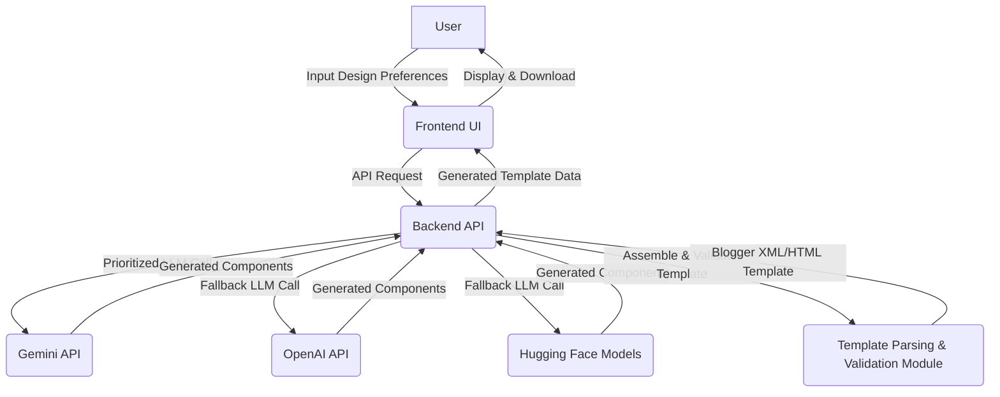

# AI-Powered Blogger Template Generator: Design Document

## 1. Project Overview
This project aims to develop an AI-powered tool capable of parsing, analyzing, and generating fully compatible Blogger themes. Leveraging the advanced capabilities of Large Language Models (LLMs), primarily Google Gemini API, with optional fallbacks to other providers like OpenAI or Hugging Face, the generator will significantly simplify and accelerate the creation of custom Blogger templates. The goal is to provide a smart, efficient, and user-friendly platform for bloggers to design and implement unique themes without extensive coding knowledge.

## 2. Goals and Objectives
**Primary Goal:** To automate the process of creating high-quality, customizable Blogger templates using artificial intelligence.

**Objectives:**
*   **Parse Existing Templates:** Develop robust functionality to parse and understand the structure of existing Blogger XML/HTML templates.
*   **Analyze User Requirements:** Accurately interpret natural language descriptions and design preferences provided by users.
*   **Generate Valid Templates:** Produce Blogger-compatible XML/HTML, CSS, and JavaScript that adhere to Blogger's specific syntax and structure.
*   **Implement Gemini API:** Utilize Google Gemini API as the primary engine for template generation, leveraging its advanced understanding and generation capabilities.
*   **Multi-Provider Fallback:** Incorporate a resilient fallback mechanism using other LLM providers (e.g., OpenAI, Hugging Face) to ensure continuous operation and enhance generation quality.
*   **User-Friendly Interface:** Design an intuitive web-based interface that allows users to easily define their design preferences and preview/download generated themes.
*   **Modularity and Extensibility:** Build the system with a modular architecture to facilitate future enhancements and integration of new features.

## 3. Architecture
The system will follow a client-server architecture, comprising the following main components:

*   **Frontend (UI):** A web-based application (e.g., React, Vue, Svelte) allowing users to interact with the generator.
*   **Backend API:** A server-side application (e.g., Python with Flask/FastAPI or Node.js with Express) that handles user requests, orchestrates AI model calls, and processes template generation logic.
*   **AI Model Layer:** This layer abstracts the LLM providers. It will prioritize calls to the Gemini API and gracefully fall back to alternative providers (OpenAI, Hugging Face) if Gemini is unavailable or if specific generation tasks are better handled by other models.
*   **Template Parsing & Validation Module:** A dedicated component within the backend responsible for dissecting existing Blogger templates and validating the structure of newly generated templates.
*   **Database (Optional for V1):** For storing user preferences, generated templates history, or analytics (could be added in future iterations).



## 4. Technology Stack
*   **Backend Framework:** Python (Flask, FastAPI) or Node.js (Express)
*   **Frontend Framework:** React, Vue.js, or Svelte
*   **AI/LLM Providers:** Google Gemini API (primary), OpenAI API, Hugging Face API/models (for fallback and specialized tasks)
*   **HTML/XML Parsing:** BeautifulSoup (Python) or Cheerio (Node.js)
*   **Styling:** Tailwind CSS, SASS/LESS
*   **Package Management:** npm/yarn (Frontend), pip (Python Backend)
*   **Database (Future):** PostgreSQL, MongoDB (for user data, template history)
*   **Version Control:** Git, GitHub
*   **Deployment:** Docker, Kubernetes (for scalability), Vercel/Netlify (for frontend), Google Cloud Platform (GCP), AWS, or Azure (for backend and AI services).

## 5. Core Functionality

### Parsing
*   **Input Handling:** Ability to accept Blogger template XML/HTML files or URLs of existing Blogger blogs.
*   **Structure Extraction:** Deconstruct the input into logical Blogger-specific sections: `<b:skin>`, `<b:template-skin>`, `<b:section>`, `<b:widget>`, `<![CDATA[...]]>` for CSS/JS, and standard HTML elements.
*   **Variable Identification:** Recognize Blogger data tags (e.g., `<data:blog.title/>`, `<data:post.body/>`) and conditional statements.
*   **Error Handling:** Identify and report malformed or non-Blogger-compliant input.

### Analysis
*   **User Input Interpretation:** Translate natural language descriptions (e.g., "a minimalist blog for photography with a dark theme and serif fonts") into actionable design parameters.
*   **Design Pattern Recognition:** Analyze successful Blogger templates or design trends to inform generation, ensuring aesthetic appeal and usability.
*   **Constraint Management:** Understand and apply constraints related to Blogger's platform limitations and best practices.
*   **Theme Coherence:** Ensure that generated components (header, body, sidebar, footer, CSS, JS) form a cohesive and functional theme.

### Generation
*   **LLM-Powered Content Generation:** Utilize the selected LLM (Gemini first) to generate valid Blogger XML/HTML snippets for various template sections based on user input and analysis.
*   **CSS and JavaScript Generation:** Generate styling rules and interactive scripts that are theme-appropriate and Blogger-compatible.
*   **Modular Assembly:** Combine the AI-generated components into a complete Blogger XML template file.
*   **Syntax & Structure Enforcement:** Programmatically ensure the generated output adheres to Blogger's required XML structure, including correct closing tags, widget definitions, and data tag usage.
*   **Validation:** Perform a final check on the generated template for common errors, ensuring it is deployable on Blogger.
*   **Customization:** Allow for granular control over elements like fonts, color palettes, layouts (1-column, 2-column, etc.), and responsiveness.

## 6. Data Flow
1.  **User Input:** The user provides design preferences, keywords, desired layout, and other stylistic choices via the frontend UI.
2.  **Request to Backend:** The frontend sends a JSON payload containing these preferences to the Backend API (e.g., `/api/generate-template`).
3.  **Backend Processing:** The Backend API receives the request, preprocesses the input, and constructs a detailed prompt for the AI Model Layer.
4.  **AI Model Layer Interaction:** The Backend sends the prompt to the Gemini API. If Gemini fails or a fallback is configured, it directs the prompt to an alternative LLM (OpenAI, Hugging Face).
5.  **Component Generation:** The LLM generates various template components (e.g., header HTML, sidebar XML, main CSS, specific JS functions) as structured text.
6.  **Backend Assembly & Validation:** The Backend API receives the generated components, assembles them into a complete Blogger XML template, and runs it through the Template Parsing & Validation Module to ensure correctness and compatibility.
7.  **Response to Frontend:** The Backend API sends the complete generated Blogger XML template (as a string) back to the frontend.
8.  **Frontend Display & Download:** The frontend displays a preview of the template and offers options to download the `.xml` file or copy the code.

## 7. User Interface (Conceptual)

*   **Input Form:** A clear and intuitive form for users to describe their desired blog theme. This could include:
    *   **Text Description Area:** For natural language input (e.g., "A clean, modern food blog with vibrant colors.").
    *   **Style Pickers:** Color palette selectors, font family dropdowns (serif, sans-serif, monospace), typography settings (heading sizes, body text size).
    *   **Layout Options:** Radio buttons or toggles for 1-column, 2-column (left/right sidebar), 3-column layouts.
    *   **Feature Toggles:** Checkboxes for specific features (e.g., "sticky header," "social media icons," "responsive design").
    *   **Preview Button:** To generate and display the template.
*   **Live Preview Area:** A dynamically rendered iframe or a dedicated section displaying the generated template, allowing users to see changes in real-time.
*   **Download/Export Options:** Buttons to download the full Blogger XML template file, copy the code to clipboard, or potentially integrate directly with Blogger (future enhancement).
*   **Feedback/Error Messages:** Informative messages for successful generation, validation errors, or API issues.

## 8. Future Enhancements
*   **Direct Blogger API Integration:** Allow users to directly upload generated themes to their Blogger account.
*   **Advanced Customization UI:** Implement a visual drag-and-drop editor or more detailed configuration panels for template elements.
*   **AI-Powered Content Generation:** Generate placeholder blog posts, images, or widget content to give a more complete preview.
*   **Theme Library & Sharing:** Allow users to save, manage, and share their generated themes within the platform.
*   **Performance & SEO Optimization:** Integrate AI analysis to suggest or apply SEO best practices and performance optimizations to generated templates.
*   **A/B Testing:** Facilitate A/B testing of different generated themes to determine optimal user engagement.
*   **Learning from Feedback:** Implement a feedback loop where user ratings and modifications help refine the AI's generation capabilities.
*   **Support for Other Platforms:** Extend the generator to support other static site generators or CMS platforms.

## 9. API Design

### `/api/generate-template` (POST)
*   **Description:** Initiates the template generation process based on user preferences.
*   **Request Body (JSON):**
    ```json
    {
      "description": "A minimalist blog for showcasing photography, dark mode preferred, with a focus on large images.",
      "style": {
        "primary_color": "#283747",
        "secondary_color": "#D7DBDD",
        "font_family_heading": "Montserrat",
        "font_family_body": "Open Sans",
        "layout": "two-column-right-sidebar",
        "responsive": true,
        "features": ["sticky_header", "social_icons", "pagination"]
      },
      "source_template_url": "optional_url_to_an_existing_blogger_template_for_inspiration"
    }
    ```
*   **Response Body (JSON):**
    ```json
    {
      "status": "success",
      "message": "Blogger template generated successfully.",
      "template_xml": "<!DOCTYPE html>\n<html...>...</html>",
      "preview_url": "http://example.com/preview/generated-template-id"
    }
    ```
*   **Error Response (JSON):**
    ```json
    {
      "status": "error",
      "message": "Failed to generate template due to invalid input.",
      "details": "..."
    }
    ```

## 10. Deployment Considerations
*   **Scalability:** Design the backend to handle concurrent requests to the LLM APIs, potentially using serverless functions (e.g., AWS Lambda, Google Cloud Functions) or container orchestration (Kubernetes).
*   **Security:** Secure API keys for LLM providers and ensure proper input sanitization to prevent injection attacks.
*   **Cost Optimization:** Monitor LLM API usage and implement caching strategies or rate limiting to manage operational costs. Consider different pricing tiers for LLM providers.
*   **CI/CD Pipeline:** Establish a robust Continuous Integration/Continuous Deployment pipeline for automated testing, building, and deployment of both frontend and backend components.
*   **Monitoring and Logging:** Implement comprehensive monitoring and logging for application performance, error tracking, and LLM API usage.
*   **Containerization:** Use Docker for packaging the backend application, ensuring consistent environments across development, staging, and production.
*   **Environmental Variables:** Manage sensitive information (API keys, database credentials) using environment variables securely.
